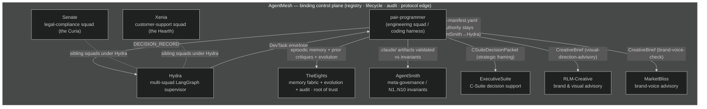
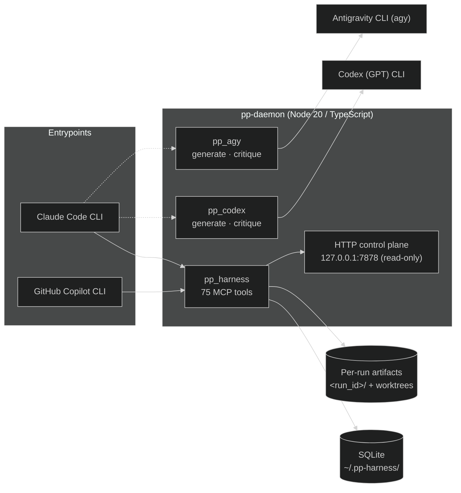
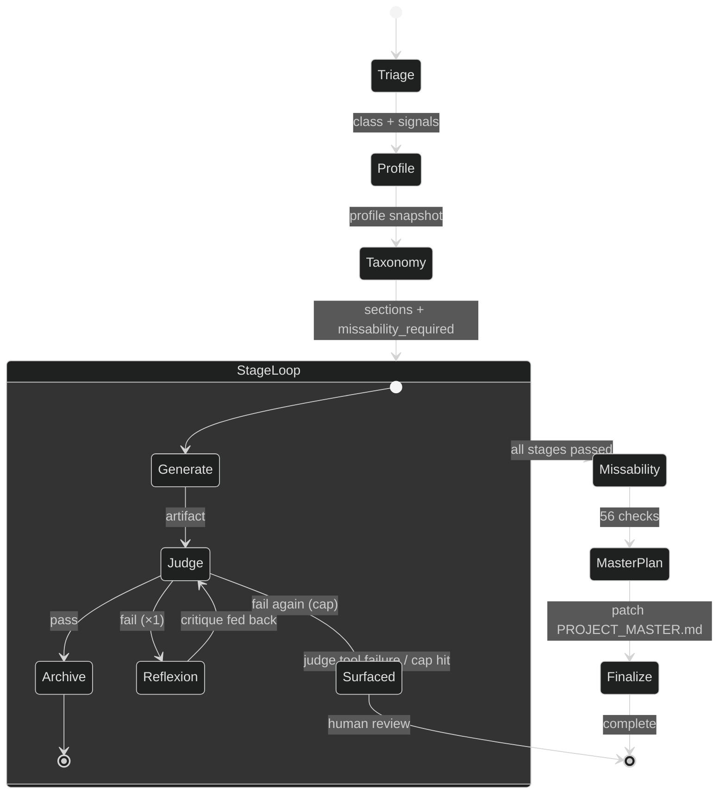
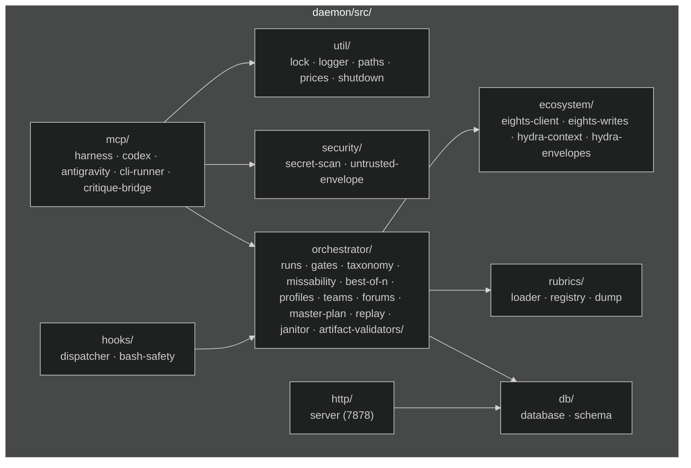
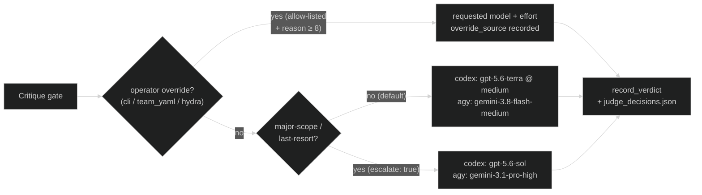
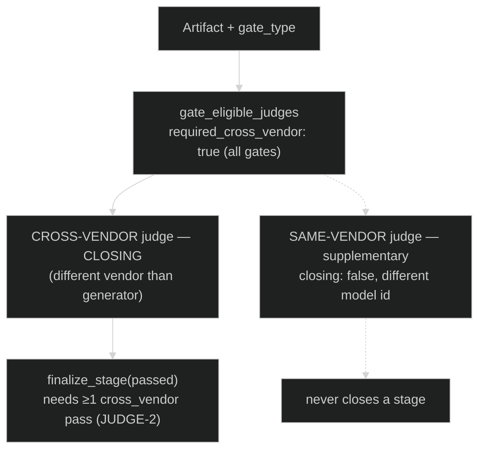
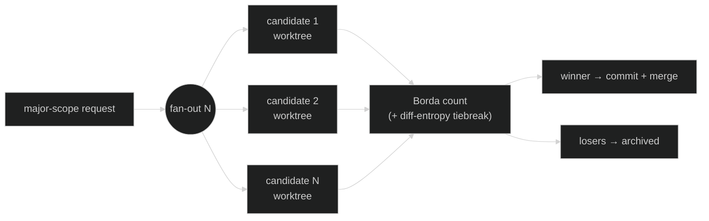

# pair-programmer Architecture

This document is the engineer-facing companion to [`README.md`](README.md) and
[`docs/USER_GUIDE.md`](docs/USER_GUIDE.md). It describes the runtime topology,
the daemon's MCP servers and subsystems, the nine-phase run lifecycle, and the
concepts that shape judging (tiered cross-/same-vendor routing, judge
escalation, and best-of-N + Borda selection).

pair-programmer is a TypeScript daemon (`daemon/`, Node 20) that orchestrates
code generation across **Claude**, **OpenAI Codex (GPT)**, and **Google** (via
the **Antigravity CLI**, `agy`) with tiered validation. It runs fully standalone, and also enrolls into the
sibling AI ecosystem as the **engineering squad** behind Hydra.

> Diagram convention: every Mermaid block below is mirrored by a redundant
> ASCII-art rendering of the same topology, so the document reads correctly in
> any viewer that does not render Mermaid.

---

## 1. C1 — System context

pair-programmer is the engineering harness. Hydra dispatches `DevTask`
envelopes to it; it replies with `DECISION_RECORD` envelopes. All sibling
integrations are **advisory and null-tolerant** — when a peer is offline the
harness degrades the corresponding feature to a no-op and the core
generate → judge → missability lifecycle is unaffected.



```
  +================ AgentMesh — binding control plane (tenth layer) ==============+
  ‖  ONE registry · ONE lifecycle supervisor · ONE audit timeline ·              ‖
  ‖  ONE protocol edge (A2A/REST/MCP-over-HTTP) · ONE operator console.          ‖
  ‖  Enroll via mesh-manifest.yaml (fail-closed). Authority stays:              ‖
  ‖  TheEights -> AgentSmith -> Hydra. AgentMesh routes + observes; never        ‖
  ‖  arbitrates.                                                                 ‖
  ‖                                                                              ‖
  ‖                       +-----------------------------+                        ‖
  ‖          DevTask  -->  |                             |  --> DECISION_RECORD  ‖
  ‖      (from Hydra)      |       pair-programmer        |     (to Hydra)       ‖
  ‖                       |   engineering squad / harness |                      ‖
  ‖                       +--+-----+--------+------+----+-+                       ‖
  ‖                          |     |        |      |    |                         ‖
  ‖            episodic      |     |        |      |    |   brand-voice           ‖
  ‖            memory +      |     |        |      |    |   advisory              ‖
  ‖            critiques     |     | .claude |      |    |                        ‖
  ‖                          v     v artifacts     v    v                        ‖
  ‖                     +--------+ +-------+  +-------+ +-----+ +----------+       ‖
  ‖                     |TheEights| |Smith |  |Exec   | | RLM | |MarketBliss|     ‖
  ‖                     | mem/evo | |N1-N10|  |Suite  | |creat| | brand    |      ‖
  ‖                     +--------+ +-------+  +-------+ +-----+ +----------+       ‖
  ‖                                                                              ‖
  ‖   Sibling squads under Hydra (not direct pp peers):                          ‖
  ‖     +----------------------+   +----------------------+                       ‖
  ‖     | Senate (the Curia)   |   | Xenia (the Hearth)   |                       ‖
  ‖     | legal-compliance     |   | customer-support     |                       ‖
  ‖     +----------------------+   +----------------------+                       ‖
  +==============================================================================+

  All sibling calls are advisory + null-tolerant (circuit-broken). Offline peer
  => feature degrades to no-op; generate/judge/missability core is unaffected.
```

### AgentMesh enrollment

pair-programmer ships a control-plane manifest at
[`mesh-manifest.yaml`](mesh-manifest.yaml) (`apiVersion: agentmesh/v1`,
`kind: SiblingManifest`). It declares the harness runtime (`node20-ts`,
entrypoint `daemon/dist/index.js mcp`), the full `pp_harness` tool surface, the
lifecycle breaker (`gracefulShutdownMs: 10000`, crash-loop threshold 5 /
60 s), and a **`healthProbe`** that calls the cheap no-args `doctor` MCP tool
(`intervalMs: 20000`, `failureThreshold: 3`). The mesh control plane uses this
manifest to enroll the harness, route health checks, and resolve the gateway
backend key (`backendsKey: pp_harness`, reconciled against
`~/.hydra/backends.json`).

### WS-AUTH operator-capability tokens

pair-programmer does **not** mint or verify operator-capability tokens — it is
not a governance/ticket-write authority. Token minting lives in Hydra
(`hydra_core/auth/capability.py`, HMAC-SHA256 over canonical JSON, base64url;
degraded `sig=None` when `HYDRA_OPERATOR_KEY` is unset), and server-side
**enforcement** lives in TheEights and Xenia on governance / ticket writes.
The harness's ecosystem clients (`daemon/src/ecosystem/`) are read-mostly
consumers of TheEights memory/audit/constitution surfaces; the operator
capability simply gates the downstream governance writes the harness's results
may later trigger through Hydra.

---

## 2. C2 — Container topology

A Claude Code or GitHub Copilot CLI session is the **entrypoint / driver**: it
calls the daemon's MCP tools, dispatches sub-agents, and routes judging. The
daemon hosts **three MCP servers** over stdio:

| Server | Tools | Role |
|---|---|---|
| `pp_harness` | **75** | Orchestration: runs, stages, gates, taxonomy, missability, best-of-N, profiles, teams, rubrics, replay, janitor. |
| `pp_codex`   | **2** (`generate`, `critique`) | Bridges the external **Codex (GPT)** CLI. |
| `pp_agy`     | **2** (`generate`, `critique`) | Bridges the external **Antigravity CLI** (`agy`). |

A separate **read-only HTTP control plane** binds `127.0.0.1:7878`
(`daemon/src/http/server.ts`, idle-shutdown 10 min) for status inspection.
State persists to SQLite under `~/.pp-harness/`; per-run artifacts (attempts,
verdicts, snapshots, winner/loser worktrees) are archived under
`<run_id>/` directories.



```
   +-------------+      +-------------------+
   | Claude Code |      | GitHub Copilot CLI|     (driver / entrypoint)
   +------+------+      +---------+---------+
          |                       |
          |   MCP (stdio)         |
          v                       v
   +--------------------------------------------------+
   |                pp-daemon (Node 20)               |
   |  +-----------+  +----------+  +----------+        |
   |  | pp_harness|  | pp_codex |  | pp_agy   |        |
   |  | 75 tools  |  | gen/crit |  | gen/crit |        |
   |  +-----+-----+  +----+-----+  +----+-----+        |
   |        |             |             |              |
   |        |        +----v----+   +----v----+         |
   |        |        |Codex CLI|   | agy CLI |         |
   |        |        +---------+   +---------+         |
   |   +----v---------------------+                    |
   |   | HTTP control plane       |  127.0.0.1:7878    |
   |   | (read-only, idle 10m)    |  (status only)     |
   |   +--------------------------+                    |
   +-----------+--------------------+-----------------+
               |                    |
       +-------v-------+    +-------v--------------------+
       | SQLite        |    | Per-run artifacts          |
       | ~/.pp-harness |    | <run_id>/ + git worktrees  |
       +---------------+    +----------------------------+
```

---

## 3. Run lifecycle (9 phases)

`/pp:run` walks a request through nine phases:
**triage → profile → taxonomy → stage loop (judge + Reflexion ×1) →
missability → master-plan patch → finalize**. The stage loop is itself the
generate → judge (→ Reflexion retry ×1) cycle; on a final fail the stage
**surfaces** for human review rather than shipping.



```
 triage ──▶ profile ──▶ taxonomy ──▶ ┌─ STAGE LOOP ──────────────┐
                                     │  generate ──▶ judge        │
                                     │      ▲          │ pass     │
                                     │      │ critique │          │
                                     │   reflexion ◀── │ fail ×1  │
                                     │      (then surfaced on cap)│
                                     └────────────┬───────────────┘
                                                  │ all pass
                                     missability (56) ──▶ master-plan patch
                                                  └──▶ finalize (complete | surfaced)
```

Invariants enforced across the loop: **Reflexion ×1** (exactly one
critique-fed retry per stage), a **loop ceiling** of 6 validator calls per run,
and judge **halt-on-tool-failure** (a broken critique CLI surfaces the run
rather than fabricating a pass).

---

## 4. C3 — Daemon subsystems

The daemon source (`daemon/src/`) is organized into the following subsystems
(verified against the directory tree):

| Subsystem | Path | Responsibility |
|---|---|---|
| MCP servers | `mcp/` | `harness-server.ts` (75 tools), `codex-server.ts`, `antigravity-server.ts`, the CLI runner, and the critique bridge/schema. |
| Orchestrator | `orchestrator/` | Runs, stages, gates, taxonomy, missability, best-of-N + diff-entropy, profiles, teams, forums, design templates, master-plan, AGENTS.md sync, TDD gate, replay, janitor, worktrees, `artifact-validators/`. |
| Ecosystem | `ecosystem/` | TheEights client + writes, Hydra context + envelopes. All null-tolerant / circuit-broken. |
| Hooks | `hooks/` | Hook dispatcher + bash-safety guard (29 hooks across 5 events). |
| Security | `security/` | Secret-scan, untrusted-envelope handling (PII/prompt-injection boundary). |
| DB | `db/` | SQLite database, schema, and migrations. |
| HTTP | `http/` | Read-only control plane on `127.0.0.1:7878`. |
| Rubrics | `rubrics/` | Rubric loader, registry, and dump tooling. |
| Util | `util/` | Locks, logger, paths, prices, and graceful **`shutdown.ts`**. |



```
   daemon/src/
   ├── mcp/            harness(75) · codex · antigravity · cli-runner · critique-bridge
   ├── orchestrator/   runs · gates · taxonomy · missability · best-of-n ·
   │                   profiles · teams · forums · master-plan · replay ·
   │                   janitor · tdd-gate · worktree · artifact-validators/
   ├── ecosystem/      eights-client · eights-writes · hydra-context · hydra-envelopes
   ├── hooks/          dispatcher · bash-safety        (29 hooks / 5 events)
   ├── security/       secret-scan · untrusted-envelope
   ├── db/             database · schema
   ├── http/           server                          (127.0.0.1:7878, read-only)
   ├── rubrics/        loader · registry · dump
   └── util/           lock · logger · paths · prices · shutdown
```

### Graceful shutdown

On MCP transport disconnect (`stdin` end / `transport.onclose`), SIGTERM/SIGINT,
or an unhandled rejection, the daemon runs a single idempotent
`shutdownAndExit` (`util/shutdown.ts`). It (1) refuses new child spawns, (2)
**aborts all in-flight CLI children** (SIGTERM → 2 s grace → SIGKILL), and (3)
**releases project locks** — but only once every child is confirmed dead. If any
child is unconfirmed at the cap deadline, *all* locks are conservatively
retained (never release a lock while its child may still be alive); the janitor
TTL reaper sweeps retained locks later.

---

## 5. Judging concepts

### 5.1 Judge model policy — defaults, escalation, and operator overrides

Judge models are governed by one per-vendor policy object,
**`JUDGE_MODEL_POLICY`** in `daemon/src/config.ts`. It is the single source of
truth; `DEFAULT_MODELS` is derived from it, and every mention elsewhere in the
repo (this file included) is a mirror. Repin there, never here.

| Vendor | Default lane (JUDGE-1) | Escalated lane (`escalate: true`) | Allowed critique ids | Allowed efforts |
|---|---|---|---|---|
| `codex` | `gpt-5.6-terra` @ `medium` | `gpt-5.6-sol` @ `medium` | `gpt-5.6-terra`, `gpt-5.6-sol`, `gpt-5.6-luna` | `low`, `medium`, `high`, `xhigh` |
| `agy` | `gemini-3.8-flash-medium` | `gemini-3.1-pro-high` | `gemini-3.8-flash-{high,medium,low}`, `gemini-3.7-flash-{high,medium,low}`, `gemini-3.1-pro-{high,low}` | `low`, `medium`, `high` |

The defaults are constitutional (JUDGE-1, `CONSTITUTION.md` Article V as amended
2026-09-03, SHA `5df284cb`, previously `13b4fa18` — do not change outside the
HITL `/pp:constitution amend` path). The escalated lanes are reached only by
**opt-in escalation** for major-scope / last-resort gates. agy expresses
reasoning effort through the model-id suffix: the daemon canonicalizes a bare
family + effort onto the suffixed id and never passes `--effort`.

**Option surface.** Both `pp_codex.critique` and `pp_agy.critique` accept the
same judge-override params: `model?`, `reasoning_effort?`, `escalate?`,
`override_source?`, `override_reason?`. `escalate` and `model` are **mutually
exclusive**; a non-allow-listed id **throws at the bridge** rather than being
silently replaced by the pin. The result envelope reports the **effective**
`model`, `reasoning_effort`, `override_source`, `override_reason`, and (Codex)
`pin_mismatch` — verdicts are recorded from the envelope, never from the request.

**Override precedence (JUDGE-1a)**, resolved per field, lowest first:
daemon default (`override_source: "default"` / `"escalated"`) → team yaml
`judge.{model,reasoning_effort,escalate}` (`"team_yaml"`) → CLI flags
`--judge-vendor` / `--judge-model` / `--judge-effort` / `--judge-escalate` /
`--judge-reason` (`"cli"`); `"hydra"` is the same channel for a `DevTask`
envelope. **There is no prompt layer** — overrides are never inferred from
request prose, and an override can never downgrade a cross-vendor gate.

**Where it is recorded.** `judge_decisions.json` (taxonomy 4.14) holds the
per-stage resolution; `cli_flags` is persisted on the run row; and the verdict
row carries `judge_reasoning_effort`, `judge_model_source`
(`default|escalated|cli|team_yaml|hydra`) and `judge_override_reason`
(≥ 8 chars, required for the last three). Replay and the TheEights
`DecisionRecord` carry all three.

**Freshness.** `doctor()` reports `agy_pin_served` (aggregate) with a `per_pin`
breakdown for `critique_default` / `critique_escalated` / `generate`,
`codex_pin_served` (from the CLI-reported model under `--smoke`),
`unpriced_models`, and `judge_capabilities[<vendor>]` with
`default_critique_model`, `escalated_critique_model`,
`allowed_critique_models`, `default_reasoning_effort` and
`allowed_reasoning_efforts`. `gate_eligible_judges` accepts
`requested_judge_model` / `requested_judge_effort` and returns
`allowed_judges[]` entries carrying `preferred_models[]` and `closing`.



```
   critique gate ─▶ default ──────────────▶ codex gpt-5.6-terra @ medium   (JUDGE-1)
                 │                        └▶ agy   gemini-3.8-flash-medium (JUDGE-1)
                 ├▶ escalate: true ───────▶ codex gpt-5.6-sol / agy gemini-3.1-pro-high
                 └▶ operator override ────▶ allow-listed model + effort  (JUDGE-1a)
                    (cli | team_yaml | hydra; reason ≥ 8 chars; never downgrades the gate)
                                    ⇓
        verdict row: judge_reasoning_effort · judge_model_source · judge_override_reason
        run artifacts: judge_decisions.json (4.14) · runs.cli_flags
```

### 5.2 Tiered judging (cross-vendor vs same-vendor)

**Every** gate requires a judge from a **different vendor** than the generator
(JUDGE-1 as amended 2026-09-03). `gate_eligible_judges` returns
`required_cross_vendor: true` for every `gate_type` and marks the same-vendor
lane `closing: false`. The same-vendor lane survives as a **supplementary**
extra opinion — a cheap second read — but per **JUDGE-2** a same-vendor-only
verdict never satisfies `finalize_stage(passed)`, which requires at least one
`cross_vendor=true` verdict with `outcome=pass`.

Same-producer + same-model verdicts are rejected for **every** producer (the
agy exemption was removed in J4), so a supplementary same-vendor read must run
on a different allow-listed id — typically the vendor's escalated lane.



```
   every gate ─▶ CROSS-VENDOR judge (closing)   — JUDGE-1, all gate types
              └▶ SAME-VENDOR judge (supplementary, closing:false, different model id)
                    └─ same producer + same model id ⇒ rejected for EVERY producer (J4)
```

### 5.3 Best-of-N fan-out + Borda count

For major-scope requests the harness fans out **N parallel candidates** (a mix
of models/seeds) into isolated **git worktrees**. A tournament judge ranks them;
when **N ≥ 3** the winner is chosen by **Borda count** (plus diff-entropy to
break low-information ties). The winner's worktree is committed and merged back;
losers are archived via `archive_winner_and_losers`.

At **N ≥ 3** agy joins as the **second Borda judge whenever agy is enabled** —
that is mandatory under JUDGE-1, not a driver preference. Under
`PP_DISABLE_AGY=1` the second judge is the other eligible cross-vendor lane and
the run summary MUST state the substitution.



```
   request ─▶ fan-out N candidates (model/seed mix, isolated worktrees)
                 ├─ candidate 1 ─┐
                 ├─ candidate 2 ─┼─▶ tournament judge ─▶ Borda count (N≥3)
                 └─ candidate N ─┘         + diff-entropy tiebreak
                                              ├─ winner ─▶ commit + merge back
                                              └─ losers ─▶ archived
```

---

## 6. Model tiers

Claude generation runs on a tier ladder resolved by the driver
(`daemon/src/config.ts`):

| Tier | Claude model (entrypoint) | Reach |
|---|---|---|
| haiku  | `claude-haiku-4-5-20251001` | bottom of `TIER_ORDER` ladder |
| sonnet | `claude-sonnet-5` | middle of ladder |
| opus   | `claude-opus-5` | top of `TIER_ORDER`; `shiftTier` clamps here |
| **fable** | `claude-fable-5` | **capability-gated** — off the auto-escalation ladder |

**Fable-5** is never reached by automatic `shiftTier` escalation. It is selected
only via explicit operator config: (a) the **`deep-reasoning-team`**
(`.claude/teams/deep-reasoning-team.yaml`), (b) an explicit per-stage
`generator.model_tier: fable` in any team yaml, or (c) a profile's
`model_tier_policy.per_stage_override[<stage.kind>]: fable`. There is no `--tier
fable` CLI flag and `fable` is intentionally absent from `TIER_ORDER`, so
`shiftTier("opus", +1)` clamps at opus and can never auto-escalate. (GitHub
Copilot mirrors use `COPILOT_CLAUDE_TIER_MODELS`, which is now DELIBERATELY
IDENTICAL to `CLAUDE_TIER_MODELS`; the historical "Copilot pins Opus one rev
lower" divergence was collapsed by operator decision during the gpt-5.6 /
Claude-5 refresh.)

---

## 7. Where to read more

- [`README.md`](README.md) — overview, quick start, ecosystem table.
- [`docs/USER_GUIDE.md`](docs/USER_GUIDE.md) — canonical reference (commands,
  agents, teams, profiles, rubrics, forums, hooks, MCP tools, security model).
- [`taxonomy_blueprint.md`](taxonomy_blueprint.md) — the 16-section taxonomy.
- [`CONSTITUTION.md`](CONSTITUTION.md) — the Immortal Head (rule of faith).
- [`mesh-manifest.yaml`](mesh-manifest.yaml) — AgentMesh control-plane manifest.
