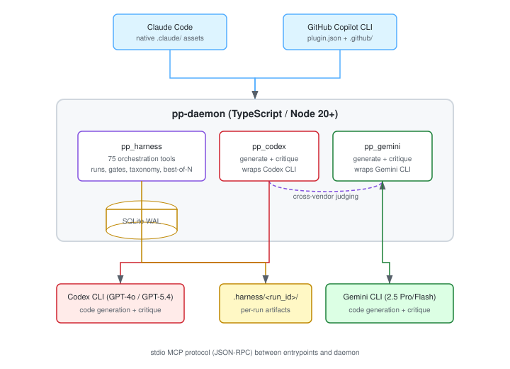
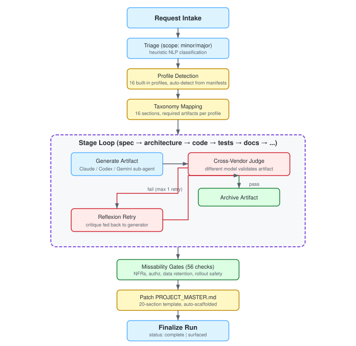
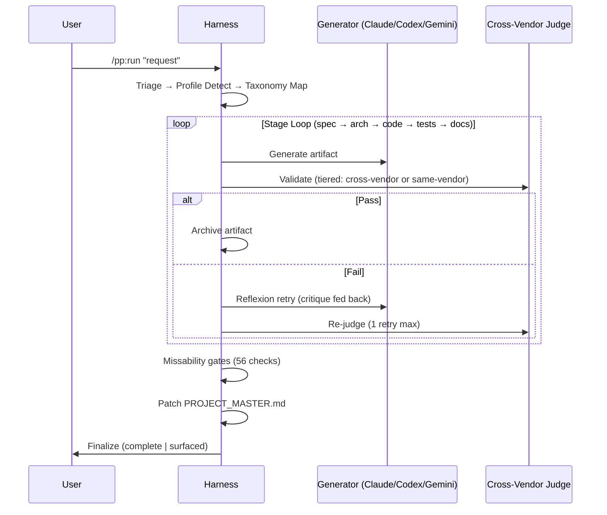
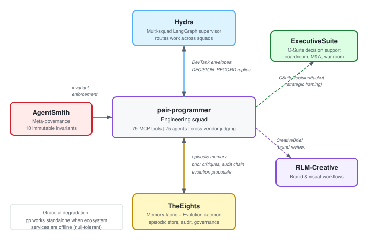

# pair-programmer

**Multi-agent coding harness with tiered model validation, taxonomy enforcement, and best-of-N generation.**

A TypeScript daemon that orchestrates code generation across Claude, OpenAI Codex (GPT), and Google Gemini with tiered validation:

- **Critical gates** (spec, design, security, contracts) → judged by a *different vendor* from the generator
- **Lower-stakes gates** (code style, docs, lint) → judged by a different model from the *same* vendor (Codex same-vendor upgrades to cross-vendor when the generator used GPT-5.4; Gemini may fall back to same-model when no alternative exists)

Supports Claude Code and GitHub Copilot CLI as entrypoints. Enforces a 16-section software development taxonomy on every task.

<p align="center">
  
</p>

---

## How It Works

pair-programmer wraps a structured lifecycle around every coding task — from a one-line bug fix to a multi-stage feature build. The daemon manages state, routes generation to sub-agents, and gates artifacts through tiered judging (cross-vendor for critical gates, same-vendor-different-model for code/docs) before they ship.

<p align="center">
  
</p>

### Key Concepts

| Concept | What it does |
|---------|-------------|
| **16-Section Taxonomy** | Every task maps to sections of [`taxonomy_blueprint.md`](taxonomy_blueprint.md) — discovery, spec, architecture, contracts, code, security, tests, docs, and more. The harness ensures no section is skipped when the profile requires it. |
| **Tiered Judging** | Spec/design/security/contract gates require a *different vendor* from the generator (Claude generates → Codex or Gemini judges). Code/docs/lint gates use a different model from the same vendor (Codex same-vendor is conditional — upgrades to cross-vendor when the generator used GPT-5.4). A degenerate same-model fallback exists for Gemini when no alternative is available. |
| **Reflexion ×1** | On judge failure, the critique is fed back to the generator for exactly one retry. If it fails again, the stage surfaces for human review. Maximum 6 validator calls per run. |
| **Best-of-N + Borda Count** | For major-scope requests, fan out to N parallel candidates (different model/seed mix in isolated git worktrees). A tournament judge picks the winner via Borda count + diff-entropy analysis. |
| **Missability Gates** | Before finalization, 56 checks verify non-functional requirements: authorization models, data retention, rollout reversibility, accessibility, console cert compliance, and more. |
| **PROJECT_MASTER.md** | A 20-section living document auto-scaffolded per project and patched by every finalized run — accumulates architecture decisions, API contracts, threat models, and operational runbooks over time. |

<details>
<summary>Run lifecycle (Mermaid)</summary>



</details>

---

## Ecosystem Integration

pair-programmer operates as the **engineering squad** within a larger multi-agent ecosystem. It works fully standalone, but gains cross-squad coordination, persistent memory, and governance enforcement when connected to sibling services.

<p align="center">
  
</p>

| System | Role | Integration |
|--------|------|-------------|
| [**Hydra**](https://github.com/lebobo88/Hydra) | Multi-squad LangGraph supervisor | Dispatches `DevTask` envelopes to pair-programmer; receives `DECISION_RECORD` replies. Bidirectional via TheEights envelope store. |
| [**TheEights**](https://github.com/lebobo88/TheEights) | Memory fabric + evolution daemon | Stores episodic memory (runs, verdicts, artifacts), serves prior critiques for cross-run Reflexion, manages evolution proposals, and provides the audit chain. |
| [**AgentSmith**](https://github.com/lebobo88/AgentSmith) | Meta-governance + invariant enforcement | Validates pair-programmer's `.claude/` artifacts against 10 immutable invariants. Schema inspection, quarantine on drift, constitutional attestation. |
| [**ExecutiveSuite**](https://github.com/lebobo88/ExecutiveSuite) | C-Suite decision support | Receives `CSuiteDecisionPacket` envelopes for strategic framing on major-tier enterprise/AI requests. Advisory, not blocking. |
| **RLM-Creative** | Brand & visual workflows | Receives `CreativeBrief` envelopes for brand-voice-check and visual-direction-advisory on UX surfaces. Advisory. |

**Graceful degradation**: pair-programmer operates fully standalone when ecosystem services are offline — cross-run memory, advisory envelopes, and evolution proposals degrade to no-ops, but the core generation/judging/missability lifecycle is unaffected. All external calls are null-tolerant with circuit breakers; the daemon never blocks on a peer that isn't responding.

---

## Quick Start

### Prerequisites

- **Node.js 20+** and npm
- **Git** (worktrees used for best-of-N isolation)
- At least one external CLI for cross-vendor judging:
  - Codex CLI: `npm i -g @openai/codex` + `OPENAI_API_KEY`
  - Gemini CLI: `npm i -g @google/gemini-cli` + `GEMINI_API_KEY`

### Build

```bash
cd daemon
npm install
npm run build
```

### First Run (Claude Code)

```bash
# Health check — confirms CLIs, DB, vendor matrix
/pp:doctor

# Single-agent run with cross-vendor judge
/pp:run "add input validation to the signup handler"

# Best-of-3 with Borda count winner selection
/pp:best-of 3 "refactor the payment module for testability"

# Specialized team pipeline
/pp:team feature-team "implement dark mode toggle"
```

The MCP servers register automatically via `.mcp.json`. Restart Claude Code after cloning so the new servers load.

### Environment Variables

| Variable | Purpose |
|----------|---------|
| `OPENAI_API_KEY` | Codex CLI authentication (or use `codex login`) |
| `GEMINI_API_KEY` | Gemini CLI authentication (or use `gemini auth`) |

Cross-vendor gates require **two** configured vendors. The `SessionStart.vendor-matrix` hook warns if only one is available.

---

## Capabilities

| Category | Count | Highlights |
|----------|-------|------------|
| **MCP Tools** | 79 | 75 on `pp_harness` (orchestration, taxonomy, gates, best-of-N, replay, janitor) + 2 on `pp_codex` + 2 on `pp_gemini` |
| **Sub-Agents** | 75 | engineer, architect, judge-cross-vendor, security-reviewer, designer, game-ai-programmer, live-ops-manager, and 68 more |
| **Slash Commands** | 19 | `/pp:run`, `/pp:best-of`, `/pp:team`, `/pp:review`, `/pp:constitution`, `/pp:evolution`, and 13 more |
| **Teams** | 24 | feature, bug-fix, refactor, security-review, ux, design-system, game-cert, game-live-ops, and 16 more |
| **Profiles** | 16 | web-ui, api-platform, enterprise, ai-agentic, mobile, game-dev-unity, game-dev-unreal, and 9 more |
| **Rubrics** | 25 | WCAG 2.2 AA, OWASP ASVS L1/L2, C4, OpenAPI 3.1, SLSA L2/L3, NIST AI RMF, Game Accessibility Guidelines, and 17 more |
| **Hooks** | 26 | `block-destructive-shell`, cost tallying, vendor-matrix check, constitution attestation, and 22 more |
| **Missability Checks** | 56 | 26 generic (NFRs, authz, data retention) + 30 game-dev (console TRC, netcode, live-service, accessibility) |
| **Skills** | 8 | pair-programmer master skill, taxonomy-adherence, master-plan-patching, game-design, frontend-design, and 3 more |

---

## Commands

| Command | Description |
|---------|-------------|
| `/pp:run "<request>"` | Single-agent generation + tiered cross-vendor judge |
| `/pp:best-of N "<request>"` | N-way parallel fan-out with Borda count winner |
| `/pp:team <name> "<request>"` | Run through a specialized team pipeline |
| `/pp:review <forum>` | Run one of 10 governance review forums |
| `/pp:retry <run_id>` | Reflexion ×1 retry on a surfaced stage |
| `/pp:gate <stage_id>` | Re-run only the judge step (no regeneration) |
| `/pp:status [run_id]` | List runs or show full run tree |
| `/pp:budget [scope]` | Token + dollar totals by run / day / model |
| `/pp:doctor` | Full health-check (daemon, CLIs, vendors, DB) |
| `/pp:taxonomy [run_id]` | Show 16-section coverage for a run |
| `/pp:master` | View or scaffold PROJECT_MASTER.md |
| `/pp:checklist` | 15-item completion check (Section 10) |
| `/pp:profile [show\|list\|template]` | View active profile or render a built-in template |
| `/pp:rubrics [list\|show <id>]` | List rubrics or show rubric body |
| `/pp:teams` | List available specialized teams |
| `/pp:replay <run_id>` | Reproduce-bundle for a past run |
| `/pp:claudemd` | Show/scaffold AGENTS.md + CLAUDE.md |
| `/pp:constitution` | View or amend CONSTITUTION.md |
| `/pp:evolution` | List/review autogenesis evolution proposals |

> **Full reference**: [`docs/USER_GUIDE.md`](docs/USER_GUIDE.md) covers every command, agent, team, profile, rubric, forum, hook, MCP tool, and the security/trust model.

---

## Installation Options

### Option A: System-wide (recommended)

Register once at user scope so `/pp:*` commands, MCP servers, hooks, agents, and skills are available in every Claude Code session:

```powershell
.\scripts\install-user.ps1
```

Updates with `git pull` — no reinstall needed (uses NTFS junctions).

### Option B: Per-project

Copy or symlink `.claude/` into your project, or run Claude Code from this repo directly.

### Option C: GitHub Copilot CLI

```powershell
.\scripts\install-user-copilot.ps1
copilot --agent pair-programmer-orchestrator
```

Installs as a Copilot CLI plugin for the current user. Re-run after `git pull` (Copilot caches plugin contents). See [`docs/INSTALL.md`](docs/INSTALL.md) for details.

---

## Project Layout

```
pair-programmer/
  daemon/                         # TypeScript daemon (MCP + SQLite + orchestration)
    src/
      mcp/                        # 3 MCP servers: harness, codex, gemini
      orchestrator/               # runs, gates, taxonomy, missability, best-of-n, profiles, teams, forums
      ecosystem/                  # TheEights client, Hydra envelopes
      rubrics/                    # 25 standard-aligned rubric definitions
      hooks/                      # 26 hook handlers (bash-safety, cost-tally, etc.)
      security/                   # untrusted-envelope wrapping, secret-scan
      http/                       # read-only control plane (127.0.0.1:7878)
      db/                         # SQLite schema + WAL connection pool
    test/                         # smoke tests (MCP roundtrip)
    package.json
  .claude/
    agents/                       # 75 sub-agent definitions
    commands/pp/                  # 19 slash commands
    teams/                        # 24 specialized team pipelines
    profiles/                     # 16 project profile templates
    rubrics/                      # rubric markdown mirrors
    skills/                       # 8 domain skills
    settings.json                 # permissions + 26 hook commands
  .github/                        # generated Copilot CLI assets
  docs/
    USER_GUIDE.md                 # full reference guide
    INSTALL.md                    # installation details
    assets/                       # SVG diagrams
  taxonomy_blueprint.md           # 16-section taxonomy (the blueprint)
  .mcp.json                       # MCP server registration (stdio)
  plugin.json                     # Copilot CLI plugin manifest
  hooks.json                      # Copilot CLI hook file
```

**State**: `~/.pair-programmer/state.db` (SQLite WAL) | **Logs**: `~/.pair-programmer/logs/` | **Artifacts**: `<project>/.harness/<run_id>/`

---

## Hardening & Configuration

| Env var | Effect |
|---------|--------|
| `PP_ENFORCE_ACTIVE_RUN=1` | PreToolUse hook hard-blocks Edit/Write outside an active run |
| `PP_ALLOW_DANGER=1` | Allows `--sandbox=danger-full-access` on Codex calls (off by default) |
| `PP_LOG_LEVEL=debug` | Verbose pino logs |
| `PP_DEBUG=1` | Include stack traces in MCP error responses |
| `PP_STRICT_AGENT_TYPE=1` | Reject `record_attempt` calls with `agent_type='general-purpose'` |

---

## Testing

```bash
cd daemon
npm run typecheck          # TypeScript strict mode
npm run build
node test/smoke.mjs        # end-to-end MCP roundtrip checks
```

---

## Related Projects

| Project | Description | Link |
|---------|-------------|------|
| **Hydra** | Multi-squad LangGraph supervisor — routes work across engineering, executive, creative squads | [github.com/lebobo88/Hydra](https://github.com/lebobo88/Hydra) |
| **TheEights** | Memory fabric + evolution daemon — episodic store, governance plane, artifact evolution | [github.com/lebobo88/TheEights](https://github.com/lebobo88/TheEights) |
| **AgentSmith** | Meta-governance — 10 immutable invariants, factory/inspector/sentinel/archivist | [github.com/lebobo88/AgentSmith](https://github.com/lebobo88/AgentSmith) |
| **ExecutiveSuite** | C-Suite decision support — boardroom orchestrator, 20 executive personas | [github.com/lebobo88/ExecutiveSuite](https://github.com/lebobo88/ExecutiveSuite) |

---

## Documentation

- [`docs/USER_GUIDE.md`](docs/USER_GUIDE.md) — Canonical reference (commands, agents, teams, profiles, rubrics, forums, hooks, MCP tools, security model)
- [`docs/INSTALL.md`](docs/INSTALL.md) — Installation options and prerequisites
- [`docs/troubleshooting.md`](docs/troubleshooting.md) — Common issues and solutions
- [`taxonomy_blueprint.md`](taxonomy_blueprint.md) — The 16-section software development taxonomy

---

## License

MIT
